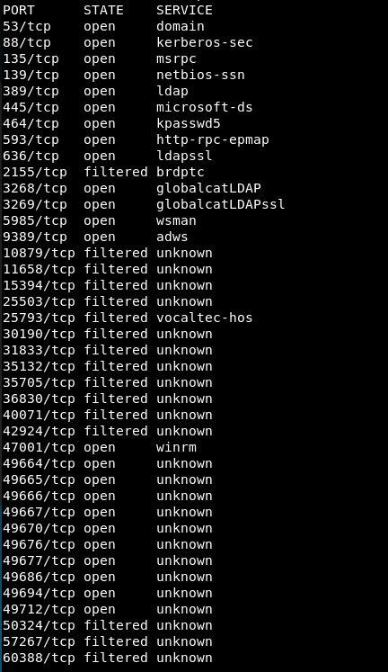
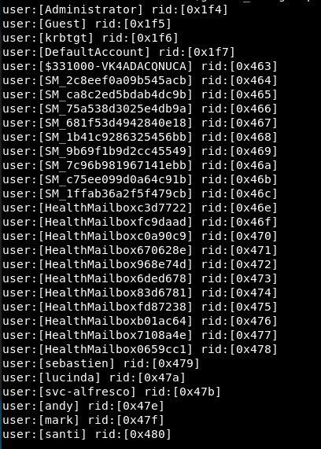
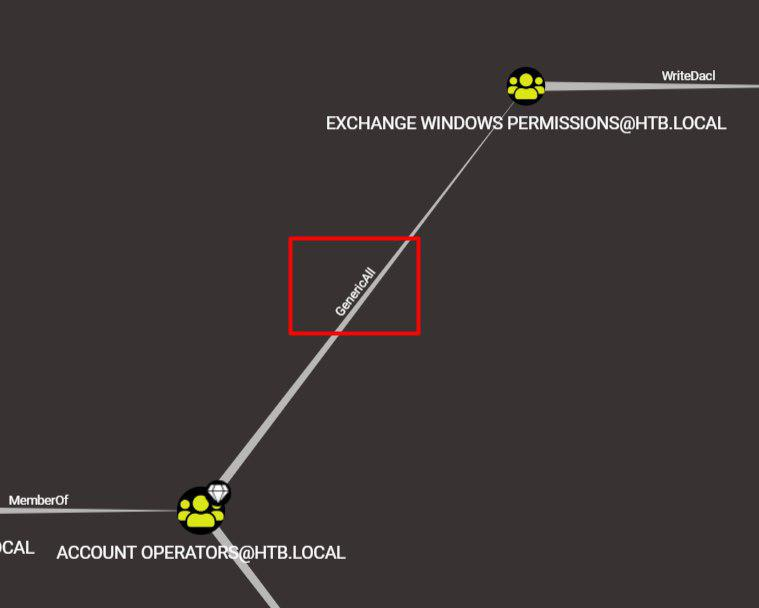
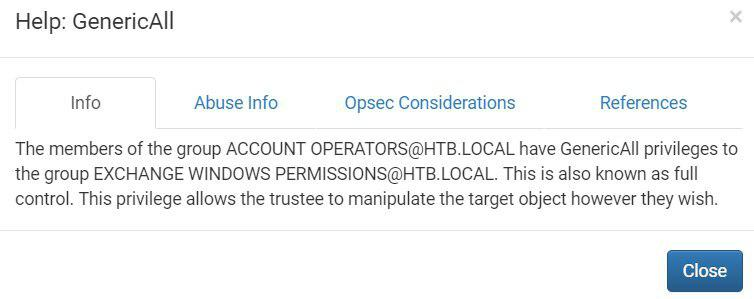
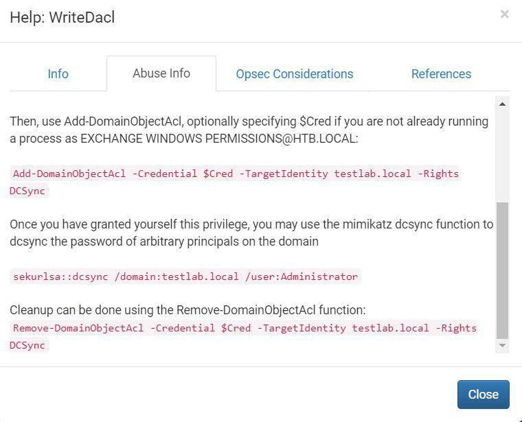

# HTB - Forest

First, we run a nmap scan:

Using enum4linux it is possible to enumerate users:

Then we carry out a [AS-REP Roasting attack](https://blog.stealthbits.com/cracking-active-directory-passwords-with-as-rep-roasting/), in this case using the Impacket's [GetNPUsers script](https://github.com/SecureAuthCorp/impacket/blob/master/examples/GetNPUsers.py):

TL;DR about the attack (sorry, I don't remember the source):

The hash can be cracked using Rockyou dictionary:

And it is possible to connect with these credentials in the Winrm service:

And grab the flag:

Then, we run the [Python Bloodhound ingestor](https://github.com/fox-it/BloodHound.py):

Part 1 - The user *svc-alfresco* is member of *Account operators*:

Part 2 - The members of this group have *GenericAll* privileges over the group *Exchange Windows Permissions*:

Part 3 - And the members of *Exchange Windows Permissions* have *WriteDacl* over the domain object:

To jump to the *Exchange Windows Permissions* group (parts 1 and 2) we must take advantage of the *GenericAll* privileges. From the Bloodhound output:

We can get the groups of this domain:

And we can use the *net* command to add the user *svc-alfresco* to the new group:

Next, to take advantage of the *WriteDacl* privileges, we check the Bloodhound output:

At this point I realized something: I had a lot of things to do (or I am very lazy) and what I was trying did not work. But I knew that this user would become a domain admin at some point in the future, getting the DCsync privilege. 

So I created a loop with the Impacket's secretdump script, and I waited...

... and it worked :S 

With the Administrator user hash we can connect with Impacket's Psexec and get the flag:

And rooted!

It was a nice box, a really good chance to use Bloodhound, one of the greatest tools today!